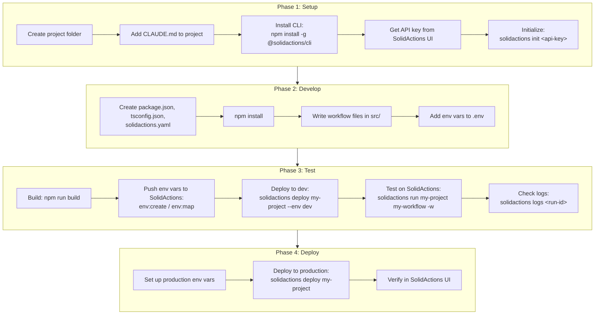

# SolidActions Development Workflow

This document shows the full development lifecycle for building and deploying SolidActions workflow projects — from initial setup to production deployment.

## Phase Details

### Phase 1: Setup

1. **Create a project folder** — Each project is deployed independently
2. **Add CLAUDE.md** — Copy from this repo or the parent directory for AI-assisted development
3. **Install the CLI** — `npm install -g @solidactions/cli`
4. **Get your API key** — From the SolidActions dashboard
5. **Initialize** — `solidactions init <api-key>` stores credentials locally

### Phase 2: Develop

1. **Create config files** — `package.json` (with `@solidactions/sdk ^0.1.1`), `tsconfig.json` (ES2022/NodeNext), `solidactions.yaml` (workflow definitions)
2. **Install dependencies** — `npm install`
3. **Write workflows** — TypeScript files in `src/` following the patterns in CLAUDE.md
4. **Configure environment** — Add API keys and secrets to `.env` for local development

### Phase 3: Test

1. **Build** — `npm run build` to verify TypeScript compiles cleanly
2. **Push env vars** — Use `solidactions env:create` and `solidactions env:map` to set up variables on the platform
3. **Deploy to dev** — `solidactions deploy my-project --env dev --create`
4. **Test remotely** — `solidactions run my-project my-workflow -i '{"key": "value"}' -w`
5. **Check logs** — `solidactions runs my-project` then `solidactions logs <run-id>`

### Phase 4: Deploy

1. **Production env vars** — Ensure all required variables are set for production
2. **Deploy** — `solidactions deploy my-project` (defaults to production)
3. **Verify** — Check the SolidActions UI for successful deployment and workflow status
